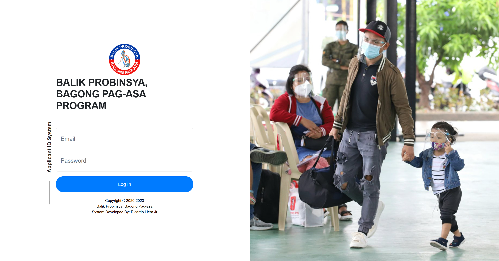

# NHA - BP2 ID System

A PHP & MySQL web-based management system for handling BP2 member records, registrations, and administrative processes.

---

## 📌 Features

- User Login Authentication
- User Registration Authentication
- Admin & User Access Control
- Add and Manage Member Information
- Responsive Bootstrap UI
- Session Management
- MySQL Database Integration
- Secure Form Validation
- CRUD Operations
- Import Excel Data
- Camera Picture Capture
- Duplicate Record Validation

---

## 🛠️ Technologies Used

- PHP Native
- MySQL
- Bootstrap 5
- HTML5
- CSS3
- JavaScript
- XAMPP / Apache

---

## 📂 Project Structure

```bash
bp2-system/
│
├── admin/
│   ├── controller/
│   ├── database/
│   ├── create-data/
│   ├── edit-data/
│   ├── delete-data/
│   ├── import-data/
│   ├── registration/
│   ├── user-account/
│   ├── camera/
│   └── profile/
│
├── user-operator/
│   ├── controller/
│   ├── database/
│   ├── create-data/
│   ├── import-data/
│   ├── camera/
│   └── profile/
│
├── auth/
│   ├── login.php
│   ├── register.php
│   └── logout.php
│
├── config/
│   └── db.php
│
├── assets/
│   ├── css/
│   ├── js/
│   ├── img/
│   └── uploads/
│
├── includes/
│   ├── header.php
│   ├── footer.php
│   └── auth_check.php
│
├── index.php
└── README.md
```

---

## ⚙️ Installation

### 1. Clone the Project

```bash
git clone git@github.com:CardzLieraJr/NHA-BP2-Id--System.git
```

---

### 2. Move Project to XAMPP htdocs

Copy the project folder into:

```bash
C:/xampp/htdocs/
```

---

### 3. Create Database

Open **phpMyAdmin** and create a new database:

```sql
CREATE DATABASE bb2;
```

Import your SQL database file.
path: db/bb2.sql

---

### 4. Configure Database Connection

Edit the database configuration file:

```php
config/db.php
```

Example:

```php
<?php

$conn = mysqli_connect(
    "localhost",
    "root",
    "root",
    "bb2"
);

if (!$conn) {
    die("Connection failed: " . mysqli_connect_error());
}

?>
```

---

### 5. Run the Project

Open your browser and visit:

```bash
http://localhost:8080/balik_probinsya/
```

---

## 🔐 Default Login Credentials

```Admin
email: admin@mail.com
Password: admin123
```

```User
email: user@mail.com
Password: user123
```

---

## 🛡️ Security Features

- Input Sanitization
- Session Authentication
- SQL Injection Protection
- Duplicate Data Validation
- Form Validation

---

## 📊 System Modules

### Admin Module

- Controller Panel
- Manage Members
- Add Members
- Edit Members
- Delete Members
- Import Excel Data
- Manage Users
- Camera Capture
- Profile Management

### User Operator Module

- Login Authentication
- Create Data
- Import Excel Data
- Camera Capture
- Profile Management

---

## 🚀 Future Improvements

- Export to PDF
- Export to Excel
- QR Code Integration

---

### 🏠 Homepage


### 🖼️ Gallery Page


### 📩 Contact Page


---

## 👨‍💻 Developer

Developed by: Ricardo Liera Jr

---

## 📄 License

This project is intended for educational and portfolio purposes only.